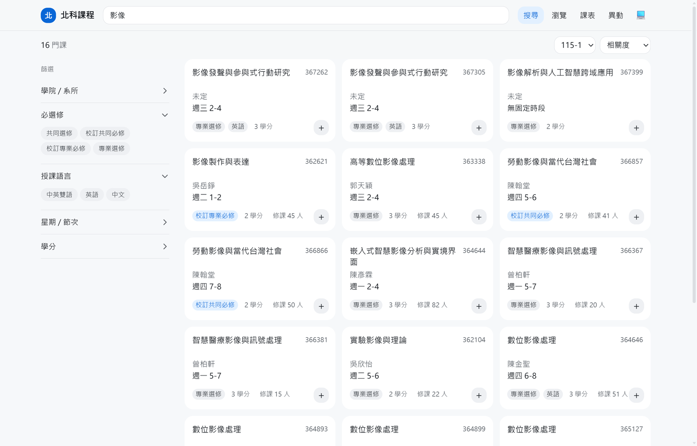
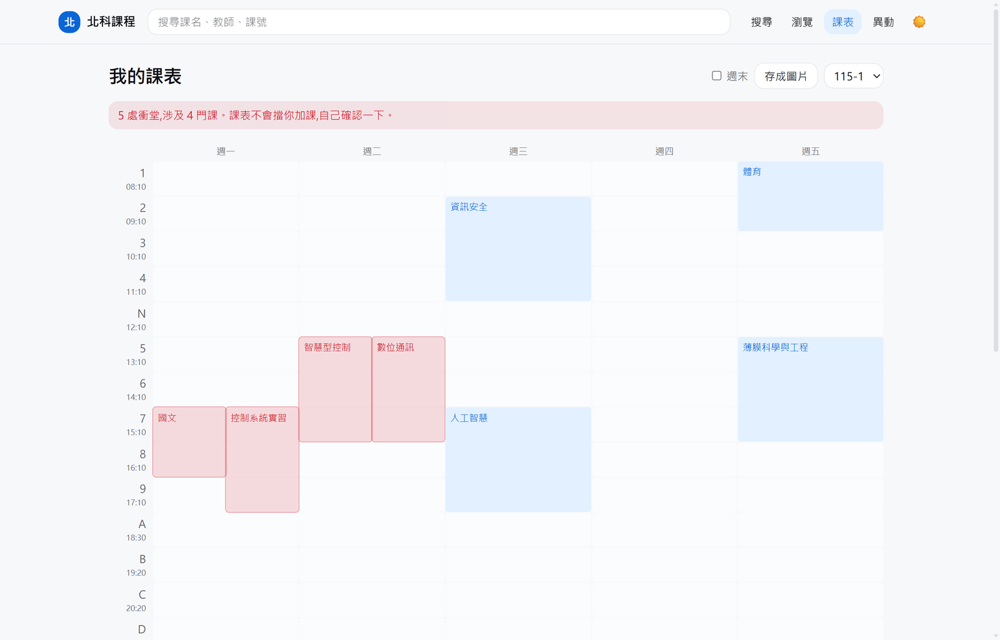

# 北科課程

臺北科技大學的課程查詢：搜尋、教學大綱、系所與教師瀏覽、排課表。

**[ntut-course.allenyen.net](https://ntut-course.allenyen.net)**

> **非官方網站。** 一切以學校公告與課程系統當下顯示的內容為準。



---

## 這個站在做什麼

| 頁面        | 內容                                                   |
| ----------- | ------------------------------------------------------ |
| `/search`   | 關鍵字搜尋，加上系所 / 必選修 / 語言 / 時段 / 學分篩選 |
| `/browse`   | 系所、教師、學程、教室四個分頁，各自有明細頁           |
| `/rooms`    | 空教室：框選時段，列出那幾節都沒課的教室               |
| `/course/…` | 課程詳情與教學大綱                                     |
| `/schedule` | 我的課表：格線、衝堂偵測、學分統計、異動標示、PNG 匯出 |
| `/changes`  | 最近異動時間軸                                         |
| `/about`    | 資料來源、已知限制、開放 API 說明                      |

搜尋條件**全部放在網址上**，所以任何一個查詢結果都可以直接複製給別人。
離線可用（PWA），深色模式，個人資料只存在瀏覽器並可匯出 / 匯入。



_衝堂的課並排標紅，不阻擋加課 —— 使用者可能正在比較兩個方案。_

---

## 資料從哪裡來

資料由 [`ntut-course-crawler`](https://github.com/tntrock/ntut-course-crawler)
自動蒐集自學校的課程查詢系統，發布成一組**公開的靜態 JSON**。
本站只是讀那些檔案，沒有後端、沒有資料庫、沒有帳號。

```
https://tntrock.github.io/ntut-course-crawler/meta.json
```

`meta.json` 列出所有端點與收錄的學期，是所有其他請求的入口。
沒有金鑰、沒有速率限制、CORS 全開 —— 你也可以直接拿去用。

資料的涵蓋範圍與已知限制寫在站上的
[關於頁](https://ntut-course.allenyen.net/about)。

---

## 為什麼這樣做

這一節記的是看程式碼看不出來的決定。完整的規格與 42 條實作偏離紀錄在
[`plan.md`](./plan.md)（附錄 D）。

### 資料的形狀決定了程式的形狀

寫之前把 API 的每個欄位對線上資料核對過一遍，有幾件事跟直覺不一樣，而且每一件
都直接影響了實作：

- **課號跨學期不通用**，而且「合開」的課各班級是**不同課號**。所以課表、收藏
  一律以 `{學期}:{課號}` 為 key，各學期獨立，不做遷移。
- **節次順序不是字典序**：`1 2 3 4 N 5 6 7 8 9 A B C D` —— 4 之後是午休 N，
  9 之後是夜間 A。任何跟「連續」「最早 / 最晚」有關的邏輯都必須讀
  `meta.periods` 的陣列順序，不能自己排。
- **`required` 是三態**，`null` 代表原始欄位空白而不是「不是必修」。學分統計因此
  分成必修 / 選修 / 未標示三欄，把 `null` 併進選修會讓試算悄悄算錯。
- **教師要用代碼識別**：803 個教師代碼只對應 801 個姓名，確實有同名老師。
  所有連結、收藏、比對一律用 `teacher_codes`，姓名只拿來顯示。

### 版本化快取（`src/lib/api.ts`）

資料放在 GitHub Pages，`Cache-Control: max-age=600` 改不掉 —— 對「舊學期的資料
永遠不會再變」來說太短了。做法是把該學期的 `generated_at` 當版本號塞進 query
string：

```
GET {BASE}/115-1/index.json?v=2026-09-05T03:34:59Z
```

GitHub Pages 忽略認不得的 query string 照樣回檔案，但瀏覽器與 Cache Storage 會把
它當成不同的 URL。於是版本沒變就命中快取（零網路請求），版本一變就自動抓新的。
同路徑的舊版本會被清掉，快取不會無限成長。

`meta.json` 是唯一的例外 —— 它是其他所有端點的版本來源，永遠網路優先，
抓不到時退回快取並在畫面上標示成離線資料。

Cache Storage 不可用（無痕視窗、企業政策）時自動降級成純網路，功能不受影響。

### 兩層快取，互不干涉

Service worker（Workbox）**只管 app shell**，完全不碰 API 資料 —— 那一份由上面
那層管。兩套快取管同一份資料只會互相打架，而且只有版本化那層知道
`generated_at`，Workbox 不知道。

Service worker 用 `registerType: 'prompt'` 而不是 `autoUpdate`：自動更新會在背景
換掉程式碼並重新載入頁面，而使用者可能正排課排到一半。

### 個人資料寧可備份也不丟掉（`src/lib/storage.ts`）

課表存的是**課號加一份快照**，不只是課號。這讓兩件事成為可能：離線時直接用快照
畫課表；連上線後把快照跟最新資料比對，課被停開、調課、換老師、改學分都能標出來。

兩條硬規則：

1. `loadStore()` **永遠不丟例外、永遠回傳可用的結構**。個人資料出問題不該讓整個
   網站變成白畫面。
2. **絕不靜默丟掉資料。** 整包救不回來時先原樣備份到另一個 key 再重置，並且在
   畫面上告訴使用者、提供下載 —— 課表默默變空而沒有任何說明，使用者只會覺得
   網站弄丟了他的東西。

### 搜尋不用索引庫

2,717 筆 × 幾個查詢詞的 `indexOf` 在手機上是毫秒等級；索引庫解決的是十萬筆以上的
問題，差兩個數量級。而且中文沒有空白分詞，模糊比對按字元算編輯距離會給出大量
無關結果 —— 打「白敦文」就該是找含這三個字的，不要有驚喜。

搜尋跑在 Web Worker 裡，最差情況（空查詢、全部課程）實測 4.7ms。

### 相容性

crawler 的承諾是：新增欄位不升 `schema_version`，移除欄位 / 改型別 / 改語意才升版。
所以型別只宣告用得到的欄位，也不做 runtime schema 驗證。版本不符時顯示警告橫幅
但**仍照常渲染** —— 這條在 2026-09-05 真的派上用場了，當時 crawler 升到 v3
改了大綱進度的資料型別，站上有警告但沒有壞掉。

---

## 開發

```bash
npm install
cp .env.example .env
npm run dev          # http://localhost:5173
```

| 指令                 | 用途                                               |
| -------------------- | -------------------------------------------------- |
| `npm run dev`        | 開發伺服器                                         |
| `npm run build`      | 產生 `dist/`                                       |
| `npm run preview`    | 預覽 build 結果                                    |
| `npm test`           | 跑一次測試                                         |
| `npm run test:watch` | 監看模式                                           |
| `npm run lint`       | oxlint                                             |
| `npm run format`     | Prettier                                           |
| `npm run deploy`     | build 後部署到 Cloudflare（需先 `wrangler login`） |

環境變數只有一個，資料來源的網址不寫死在程式碼裡：

```
VITE_API_BASE=https://tntrock.github.io/ntut-course-crawler
```

### 原始碼結構

```
src/
├── lib/          純函式：搜尋、篩選、排序、快取、儲存、課表、異動
├── hooks/        TanStack Query 的 queryOptions 與 store 的接線
├── routes/       檔案式路由（TanStack Router）
├── components/   依頁面分組
└── types/api.ts  crawler API 的型別，逐欄位對過線上資料
```

商業邏輯集中在 `lib/`，全部是純函式，測試不需要碰 DOM 或網路。

### 一個容易踩到的地方

`src/routeTree.gen.ts` **要進版控**。`build` 的順序是 `tsc -b` 先於 `vite build`，
而這個檔案平常由 Vite plugin 產生 —— CI 上沒有它，型別檢查會直接失敗。
所以它進版控，`build` 也會先跑一次 `tsr generate` 確保它是最新的。

---

## 測試

285 個測試，全部是 Vitest。涵蓋的是**會悄悄出錯的地方**，不是為了衝覆蓋率：

- 搜尋的正規化與評分、篩選器的每個邊界
- 節次的連續判斷（`2、4` 不能寫成 `2-4`，那等於謊稱包含第 3 節）
- 快取的版本切換與舊版本清理
- 儲存層的損毀復原、版本不符、配額用盡、無痕視窗
- 課表的衝堂、並排分欄、學分三態統計
- 異動事件的台北日期分組、代碼翻譯

```bash
npm test
```

CI 在每次 push 跑 lint、格式檢查、測試、build 四關。

---

## 部署

推到 `main` 就會自動部署到 Cloudflare Workers（Static Assets）。

深層網址（例如 `/course/115-1/364893`）的 SPA fallback 由 `wrangler.jsonc` 的
`not_found_handling` 處理 —— **不是** `_redirects`，那在 Workers Assets 上是
不合法的（`plan.md` 附錄 D.6 有完整的踩坑紀錄）。

---

## 回報問題

- 資料本身有錯 → [ntut-course-crawler](https://github.com/tntrock/ntut-course-crawler/issues)
- 畫面或功能有問題 → [本 repo 的 issues](https://github.com/tntrock/ntut-course-web/issues)

## 授權

[MIT](./LICENSE)
